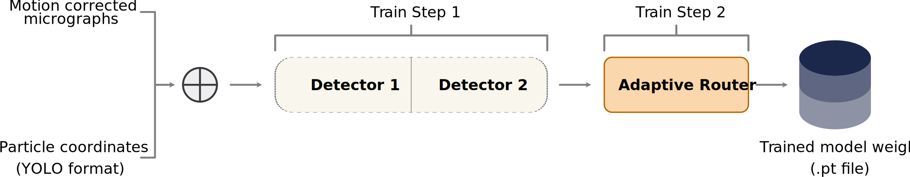

# 3. Train Adaptive Router
PartiNet's architecture requires a two-step training regime. This step assumes you have [already trained PartiNet to identify particles](training/train1.md). Next you will train PartiNet's adaptive router to discriminate between hard and easy micrographs for real-time routing during detection. This step is almost identical to the previous training step, except that your model weight **MUST** be a `.pt` file from step 1.



## Quick Start

<div class="container-tabs">
```shell title="Apptainer/Singularity"
apptainer exec --nv --no-home \
    -B /data oras://ghcr.io/wehi-researchcomputing/partinet:main-singularity partinet train step2 \
    --weight /data/partinet_trainstep1/exp/weights/last.pt \
    --data /data/cryo_training.yaml \
    --project /data/partinet_trainstep2 \
    --epochs 10
```
```shell title="Docker"
docker run --gpus all -v /data:/data \
    ghcr.io/wehi-researchcomputing/partinet:main partinet train step2 \
    --weight /data/partinet_trainstep1/exp/weights/last.pt \
    --data /data/cryo_training.yaml \
    --project /data/partinet_trainstep2 \
    --epochs 10
```
```shell title="Local Installation"
partinet train step2 \
    --weight /data/partinet_trainstep1/exp/weights/last.pt \
    --data /data/cryo_training.yaml \
    --project /data/partinet_trainstep2 \
    --epochs 10
```

</div>

## Parameters

### Required Parameters

| Parameter | Description |
|-----------|-------------|
| `--weight` | Path to the trained weights file from [Step 1](./train1.md). You **must** use the `.pt` file from your completed Step 1 training (e.g., `last.pt`). The pre-trained public weights cannot be used for this step. |
| `--data` | Path to the YAML configuration file containing your training dataset information (see [Data Preparation](training/split.md) for format details). |
| `--project` | Output directory where training results, checkpoints, and logs will be saved. |
| `--epochs` | Number of training epochs. For training the adaptive router, this only needs to be between 10-20 epochs. |

### Optional Parameters

| Parameter | Default | Description |
|-----------|---------|-------------|
| `--workers` | 8 | Number of data loading workers. Adjust based on your CPU cores and I/O performance. |
| `--device` | None | Specify GPU device (e.g., `0`, `1`, or `0,1` for multiple GPUs). If not specified, uses all available GPUs. |
| `--batch` | 16 | Training batch size. If you encounter out-of-memory (OOM) errors, reduce this value (try 8 or 4). |

:::warning Step 2 Requirement
The `--weight` parameter for Step 2 training **must** point to a checkpoint from Step 1 training (e.g., `last.pt` or `best.pt`). You cannot use the pre-trained public weights or train from scratch for this step.
:::

:::tip Training Duration
Step 2 training is much slower than Step 1. You only need 10-20 epochs to train the adaptive router effectively. Using more epochs is unlikely to improve performance significantly.
:::

## Training Output

See [Training Output Reference](training/training-output.md) for details about the files generated during training, monitoring progress, and resuming interrupted runs.

**To resume this step from a checkpoint:**

<div class="container-tabs">
```shell title="Apptainer/Singularity"
apptainer exec --nv --no-home \
    -B /data oras://ghcr.io/wehi-researchcomputing/partinet:main-singularity partinet train step2 \
    --weight /data/partinet_trainstep2/exp3/weights/last.pt \
    --data /data/cryo_training.yaml \
    --project /data/partinet_trainstep2 \
    --epochs 10
```
```shell title="Docker"
docker run --gpus all -v /data:/data \
    ghcr.io/wehi-researchcomputing/partinet:main partinet train step2 \
    --weight /data/partinet_trainstep2/exp3/weights/last.pt \
    --data /data/cryo_training.yaml \
    --project /data/partinet_trainstep2 \
    --epochs 10
```
```shell title="Local Installation"
partinet train step2 \
    --weight /data/partinet_trainstep2/exp3/weights/last.pt \
    --data /data/cryo_training.yaml \
    --project /data/partinet_trainstep2 \
    --epochs 10
```

</div>